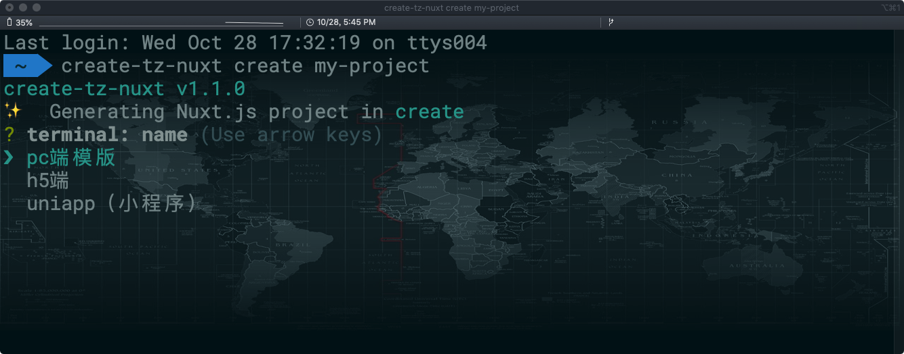
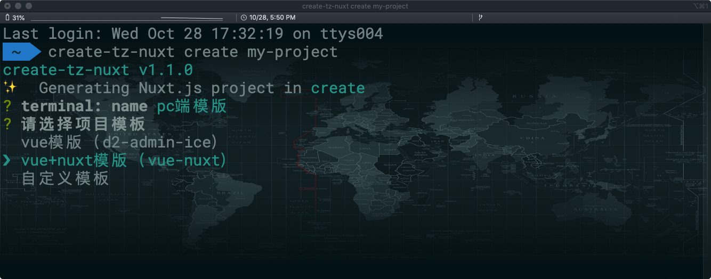
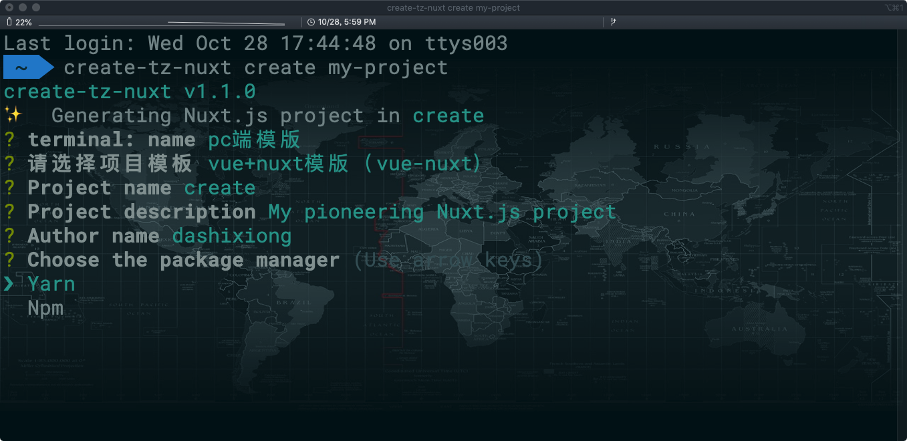

# 创建一个项目

## create-tz-nuxt create

运行以下命令来创建一个新项目：

```bash
t create project -d my-project
# OR
trn create project -d my-project

```

:::

warning 警告
如果你在 Windows 上通过 minTTY 使用 Git Bash，交互提示符并不工作。你必须通过 `winpty trn/t.cmd create project -d my-project` 启动这个命令。不过，如果你仍想使用 `create-tz-nuxt create my-project`，则可以通过在 `~/.bashrc` 文件中添加以下行来为命令添加别名。
`alias trn/t='winpty vue.cmd'`
你需要重新启动 Git Bash 终端会话以使更新后的 bashrc 文件生效。

:::

你会被提示选取一个 终端类型。你可以选择 pc、h5 和 uniapp(小程序),默认是 pc



这个默认的设置非常适合快速创建一个新项目的原型，而手动设置则提供了更多的选项，它们是面向生产的项目更加需要的。

接下来你可以选择对应终端的模版项目



每一个项目模版都是最佳实践,包含了快速启动项目开发必备特性。

在项目创建的过程中，你也会被提示选择其他一起项目名称、描述、作者、package manager 等,按照自己的需求选择即可。



`create-tz-nuxt` 命令有一些可选项，你可以通过运行以下命令进行探索：

```bash
t  --help
```

```bash
选项：

  -t, --terminal <pc>       			忽略提示符并使用已保存的或远程的预设选项
  -i, --info                     		忽略提示符并使用默认预设选项
  --answers <json>       			    忽略提示符并使用内联的 JSON 字符串预设选项

  -v, --version                         输出脚手架版本信息
  -h, --help                            输出使用帮助信息
```
